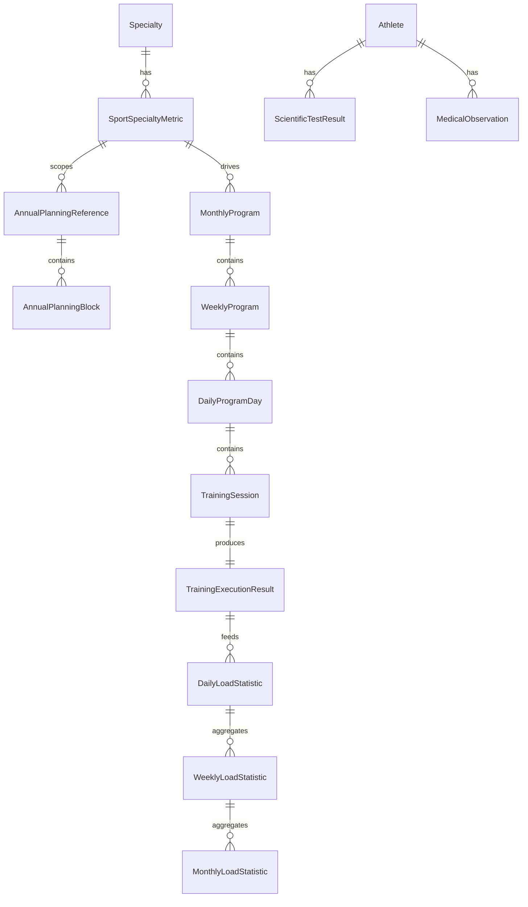

# محور التخطيط والبرمجة — التصميم الشامل

**المشروع:** EliteAthletesModule  
**التاريخ:** 2026-04-28  
**الغرض:** بناء محور تخطيط وبرمجة متكامل يخدم كل `SportSpecialtyMetric` على حدة، ويجعل التخطيط السنوي مرجعًا تأسيسيًا فقط، بينما تكون القيمة التشغيلية الحقيقية في البرمجة الشهرية والأسبوعية واليومية، مع تتبع النتائج الفنية والعلمية والطبية.

---

## 1) الفكرة الأساسية للمحور

هذا المحور لا يجب أن يُفهم كمجرد جدول زمني، بل كنظام تشغيل رياضي كامل يترجم:

- المرجع السنوي إلى هيكلة عامة للموسم.
- القرارات الفنية إلى برامج شهرية قابلة للتعديل.
- البرنامج الشهري إلى برنامج أسبوعي دقيق.
- البرنامج الأسبوعي إلى حصص يومية واضحة.
- الحصص اليومية إلى نتائج فعلية:
  - فنية
  - بدنية
  - علمية
  - طبية

### المبدأ الحاكم

كل سجل من `SportSpecialtyMetric` يمثل **مسارًا برمجيًا مستقلًا** داخل نفس المنظومة.  
بمعنى آخر:

- لا توجد برمجة واحدة عامة لجميع الرياضيين.
- توجد برمجة لكل معيار/فئة رياضية.
- يمكن تحيين البرنامج الشهري حسب القرار الفني.
- التخطيط السنوي يظل مرجعًا عامًا ثابتًا في بداية السنة، وليس ساحة تعديل فني يومي.

---

## 2) الأهداف الوظيفية للمحور

1. تمثيل المرجع السنوي للموسم الرياضي.
2. إنتاج برامج شهرية مرتبطة بكل `SportSpecialtyMetric`.
3. تفصيل البرنامج الشهري إلى أسابيع ثم أيام ثم حصص.
4. تسجيل التنفيذ الفعلي ومقارنته بالمخطط.
5. ربط التخطيط بالمحاور الأخرى:
   - الإداري
   - الرياضي
   - العلمي الطبي
6. تمكين التحيين الفني المنضبط دون كسر مرجعية الموسم.
7. إخراج تقارير ولوحات متابعة وطباعات مطابقة للنماذج المعتمدة.

---

## 3) النطاق التشغيلي

### داخل النطاق
- التخطيط السنوي المرجعي.
- البرمجة الشهرية.
- البرمجة الأسبوعية.
- البرمجة اليومية.
- تسجيل التنفيذ.
- تقييم فني/علمي/طبي.
- الاعتماد والتوثيق والإصدارات.
- التقارير والطباعة.
- التنبيهات الخاصة بالتعارضات أو الانحرافات.

### خارج النطاق في المرحلة الأولى
- الذكاء التلقائي الكامل لتوليد الأحمال.
- التنبؤات المتقدمة المعتمدة على ML.
- التكامل مع أجهزة القياس الحيّة.
- جدولة التمارين بالوقت الحقيقي من أجهزة خارجية.

---

## 4) ربط المحور بـ `SportSpecialtyMetric`

الكيان `SportSpecialtyMetric` الموجود حاليًا هو نقطة الارتكاز الفنية للمحور.

### دوره
- يحدد نوع البرمجة المناسبة للتخصص الرياضي.
- يربط التخصص الرياضي بقيمة معيارية واضحة.
- يسمح بوجود أكثر من مسار تخطيطي داخل نفس التخصص.
- يسهّل بناء برمجة مختلفة حسب:
  - الفئة الوزنية
  - المسافة
  - المستوى
  - أي تصنيف فني آخر

### النتيجة العملية
إذا كان لدينا نفس التخصص الرياضي لكن بمعايير مختلفة، فإن:
- البرنامج السنوي يبقى متقاربًا في الهيكل العام.
- البرنامج الشهري يختلف بحسب المعيار.
- البرنامج الأسبوعي يتكيف مع الحمل المستهدف.
- الحصص اليومية تتغير بحسب القرارات الفنية والطبية والجاهزية.

---

## 5) التصميم البنيوي للبيانات

> هذا القسم يصف نموذج البيانات المقترح، ويمكن تحويله مباشرة إلى كيانات EF Core.

### 5.1 الكيانات المرجعية الحالية

#### `Specialty`
يمثل التخصص الرياضي.

#### `SportSpecialtyMetric`
يمثل معيارًا فرعيًا داخل التخصص الرياضي، وهو حجر الأساس في ربط البرمجة بالتفاصيل الفنية.

#### `Athlete`
يرتبط بالتخصص، ويمكن ربطه لاحقًا بالمقاييس البرمجية المناسبة.

#### `Competition` و `Stage`
تستخدمان كمرجع لتوزيع الأحمال والتقويم التنافسي.

#### `AthleteMedicalRecord` و `AthleteScientificRecord`
مصادر المؤشرات الطبية والعلمية التي تؤثر على التنفيذ اليومي.

---

## 6) الكيانات المقترحة لمحور التخطيط والبرمجة

### 6.1 `AnnualPlanningReference`
**الدور:** المرجع السنوي التأسيسي للموسم.

#### الحقول الأساسية
- `AnnualPlanningReferenceId`
- `Year`
- `SportSpecialtyMetricId`
- `Title`
- `Description`
- `Status` (`Draft`, `Approved`, `Archived`)
- `ApprovedByUserId`
- `ApprovedAtUtc`
- `CreatedByUserId`
- `CreatedAtUtc`
- `UpdatedByUserId`
- `UpdatedAtUtc`

#### ملاحظات تصميمية
- يتم إنشاؤه عادة في بداية السنة.
- لا يمثل أداة تعديل فني يومية.
- يحتفظ ببنية الموسم الكبرى فقط.
- يمكن استخدامه كمرجع للبرامج الشهرية.

---

### 6.2 `AnnualPlanningBlock`
**الدور:** تقسيم السنة إلى كتل مرجعية عامة.

#### الحقول الأساسية
- `AnnualPlanningBlockId`
- `AnnualPlanningReferenceId`
- `Month`
- `StartDay`
- `EndDay`
- `BlockType` (`GeneralPreparation`, `SpecialPreparation`, `PreCompetition`, `Competition`, `Recovery`, `Leave`, `Testing`, `Camp`)
- `Label`
- `Notes`
- `OrderIndex`

#### ملاحظات
- هذا الكيان يترجم المخطط السنوي إلى كتل مفهومة.
- وظيفته مرجعية أكثر من كونه تنفيذية.

---

### 6.3 `MonthlyProgram`
**الدور:** المحور الفني الفعلي الذي تُدار منه البرمجة.

#### الحقول الأساسية
- `MonthlyProgramId`
- `SportSpecialtyMetricId`
- `Year`
- `Month`
- `Status` (`Draft`, `UnderReview`, `Approved`, `Executed`, `Archived`)
- `VersionNumber`
- `PlanSourceNote`
- `ApprovedByUserId`
- `ApprovedAtUtc`
- `CreatedByUserId`
- `CreatedAtUtc`
- `UpdatedByUserId`
- `UpdatedAtUtc`

#### ملاحظات
- هذا هو الكيان الأكثر حساسية في المحور.
- يمكن تحيينه فنيًا بحسب القرار التدريبي.
- يجب أن يدعم الإصدارات لأن التعديل الشهري جزء طبيعي من العمل الفني.
- كل شهر لكل `SportSpecialtyMetric` يمكن أن ينتج برنامجًا خاصًا.

---

### 6.4 `WeeklyProgram`
**الدور:** تفعيل الميكرو-سايكل داخل الشهر.

#### الحقول الأساسية
- `WeeklyProgramId`
- `MonthlyProgramId`
- `WeekNumber`
- `StartDate`
- `EndDate`
- `Goal`
- `MicroCycleType` (`Load`, `Recovery`, `CompetitionPrep`, `Taper`, `Testing`)
- `TechnicalPriority`
- `PhysicalPriority`
- `MedicalPriority`
- `Notes`
- `OrderIndex`

#### ملاحظات
- يجب أن يرتبط مباشرة بالشهر.
- يسهل بناء التدرج من الشهر إلى اليوم.
- يسمح بربط الحمل بالتخصص والمعيار.

---

### 6.5 `DailyProgramDay`
**الدور:** يوم البرنامج الفعلي.

#### الحقول الأساسية
- `DailyProgramDayId`
- `WeeklyProgramId`
- `DayDate`
- `DayNumberInMonth`
- `DayType` (`Training`, `Rest`, `Competition`, `Travel`, `Medical`, `Testing`)
- `Notes`
- `IsLocked`

#### ملاحظات
- يمثل اليوم الكامل ضمن البرمجة.
- هو حلقة الربط بين الأسبوع والحصص.

---

### 6.6 `TrainingSession`
**الدور:** تمثيل الحصة التدريبية للمجموعة (حسب فئة الاختصاص).

#### الحقول الأساسية
- `TrainingSessionId`
- `DailyProgramDayId`
- `SportSpecialtyMetricId` (الارتباط بفئة الاختصاص)
- `MainCoachId` (المدرب المشرف)
- `SessionType` (`Morning`, `Evening`, `Extra`, `Recovery`)
- `StartTime`
- `EndTime`
- `Location`
- `GeneralSessionGoal`
- `GeneralTechnicalContent`
- `GeneralPhysicalContent`
- `BaselineLoadTarget` (الحمل الأولي المستهدف للمجموعة)
- `Notes`

#### ملاحظات
- يمثل الحدث الزماني والمكاني الجماعي لفئة الاختصاص.
- يُنشأ مرة واحدة للمجموعة، ولا يعاد تكراره لكل رياضي.

---

### 6.7 `AthleteSessionPrescription`
**الدور:** الوصفة الفردية (التكليف) لكل رياضي داخل الحصة الجماعية.

#### الحقول الأساسية
- `AthleteSessionPrescriptionId`
- `TrainingSessionId`
- `AthleteId`
- `IsMandatory`
- `IndividualAdaptationNotes` (ملاحظات لتخصيص الحصة: مثلا جريح، أو برنامج خاص)
- `IndividualLoadTarget` (الحمل المخصص للرياضي، قد يختلف عن `BaselineLoadTarget`)

#### ملاحظات
- جدول وسيط يربط الحصة بالرياضيين المشاركين.
- يتيح تخصيص الجهد والمحتوى استجابة للفروق الفردية بدون تغيير خطة باقي الفريق.

---

### 6.8 `TrainingExecutionResult`
**الدور:** تسجيل النتيجة الفعلية لتكليف الرياضي وتقييمه للحمل.

#### الحقول الأساسية
- `TrainingExecutionResultId`
- `AthleteSessionPrescriptionId` (استبدل الارتباط المباشر بالحصة والرياضي هنا)
- `ExecutedAtUtc`
- `ExecutedByUserId`
- `WasExecuted`
- `ExecutionStatus` (`Completed`, `Partial`, `Cancelled`, `Postponed`)
- `TechnicalOutcome`
- `PhysicalOutcome`
- `ScientificOutcome`
- `MedicalOutcome`
- `CoachEvaluation`
- `MedicalEvaluation`
- `ComplianceRate`
- `DeviationNotes`
- **`AthleteLoadRating`** (0-10) — **تقييم الرياضي للحمل**
- **`AthleteLoadRatingTimestamp`** — متى قدّم الرياضي التقييم
- **`AthleteLoadFeedback`** — ملاحظات الرياضي عن الحصة
- **`CalculatedDailyLoad`** — الحمل اليومي المحسوب بناء على التقييم

#### ملاحظات
- هذا الكيان يربط التخطيط بالواقع العملي.
- **AthleteLoadRating** يُقدم من الرياضي بعد كل حصة وينتج عنه الحسابات.
- يتيح حساب الحمل الفردي بدقة بناءً على مخرجات التكليف (Prescription).

---

### 6.9 `PlanningDecision`
**الدور:** توثيق القرار الفني الذي يسبب تحيينًا في البرنامج.

#### الحقول الأساسية
- `PlanningDecisionId`
- `MonthlyProgramId`
- `DecisionDateUtc`
- `DecisionSource` (`Coach`, `TechnicalCommittee`, `MedicalStaff`, `ScientificStaff`)
- `DecisionType` (`ModifyLoad`, `ChangeContent`, `PostponeSession`, `ReplaceSession`, `AddRecovery`, `ReduceIntensity`)
- `Reason`
- `ApprovedByUserId`
- `Notes`

#### ملاحظات
- هذا الكيان مهم جدًا للحوكمة.
- يشرح لماذا تم التعديل.
- يمنع التعديل العشوائي غير الموثق.

---

### 6.10 `ScientificTestResult`
**الدور:** تخزين نتائج الاختبارات العلمية المرتبطة بالبرمجة.

#### الحقول الأساسية
- `ScientificTestResultId`
- `AthleteId`
- `SportSpecialtyMetricId`
- `TestDateUtc`
- `TestType`
- `ResultValue`
- `UnitOfMeasure`
- `Interpretation`
- `RecordedByUserId`
- `Notes`

#### ملاحظات
- يمكن ربطه بالبرنامج الشهري أو الأسبوعي.
- يفيد في تعديل الحمل واتخاذ القرار الفني.

---

### 6.11 `MedicalObservation`
**الدور:** الملاحظات الطبية المؤثرة على البرمجة.

#### الحقول الأساسية
- `MedicalObservationId`
- `AthleteId`
- `SportSpecialtyMetricId`
- `ObservationDateUtc`
- `ObservationType`
- `Severity`
- `ExpectedRestDays`
- `FitForTraining`
- `Notes`
- `RecordedByUserId`

#### ملاحظات
- يوقف أو يخفف أو يغيّر البرمجة عند الحاجة.
- مهم جدًا لربط الرياضة بالصحة.

---

### 6.12 `PlanningAttachment`
**الدور:** ملفات ومستندات التخطيط.

#### الحقول الأساسية
- `PlanningAttachmentId`
- `MonthlyProgramId`
- `FileName`
- `FilePath`
- `ContentType`
- `UploadedByUserId`
- `UploadedAtUtc`
- `Notes`

#### ملاحظات
- مناسب للنسخ الموقعة أو ملفات الطباعة أو الصور المرجعية.

---

### 6.13 `DailyLoadStatistic`
**الدور:** إحصائيات الحمل اليومي للرياضي (محسوبة من تقييمات الحصص).

#### الحقول الأساسية
- `DailyLoadStatisticId`
- `AthleteId`
- `SportSpecialtyMetricId`
- `StatisticDate`
- `PlannedLoad`
- `ActualLoad` (محسوب من جميع تقييمات الرياضي للحصص اليومية)
- `AthleteAverageRating` (متوسط التقييمات: 0-10)
- `LoadBalance` (مدى التوازن بين المخطط والفعلي)
- `Notes`
- `CreatedAtUtc`

#### ملاحظات
- يتم حسابه تلقائيًا من `TrainingExecutionResult` للرياضي في اليوم الواحد.
- يشكل الأساس لحساب الإحصائيات الأسبوعية والشهرية.

---

### 6.14 `WeeklyLoadStatistic`
**الدور:** إحصائيات الحمل الأسبوعي للرياضي.

#### الحقول الأساسية
- `WeeklyLoadStatisticId`
- `AthleteId`
- `SportSpecialtyMetricId`
- `WeekStartDate`
- `WeekEndDate`
- `PlannedWeeklyLoad`
- `ActualWeeklyLoad` (محسوب من جميع الأيام)
- `AverageAthleteRating` (متوسط تقييمات الأسبوع)
- `LoadTrend` (`Increasing`, `Decreasing`, `Stable`)
- `CompliancePercentage`
- `Notes`
- `CreatedAtUtc`

#### ملاحظات
- يُحسب من `DailyLoadStatistic` للأسبوع.
- يساعد في فهم الاتجاه العام للحمل والمسار الرياضي.

---

### 6.15 `MonthlyLoadStatistic`
**الدور:** إحصائيات الحمل الشهري للرياضي (تجميع أسبوعي).

#### الحقول الأساسية
- `MonthlyLoadStatisticId`
- `AthleteId`
- `SportSpecialtyMetricId`
- `Year`
- `Month`
- `PlannedMonthlyLoad`
- `ActualMonthlyLoad`
- `AverageAthleteMonthlyRating`
- `HighestLoadDay`
- `LowestLoadDay`
- `AverageLoadPerDay`
- `TotalDeviationPercentage`
- `RiskIndicators` (قائمة المؤشرات الحمراء: overload, underload, inconsistency)
- `Recommendations` (توصيات المدرب بناء على الإحصائيات)
- `Notes`
- `CreatedAtUtc`

#### ملاحظات
- يُحسب من `WeeklyLoadStatistic` في الشهر.
- يستخدم لاتخاذ قرارات التعديل والتحسين للشهر القادم.

---

## 7) العلاقات بين الكيانات

### علاقة التخصيص
- `Specialty` 1 → N `SportSpecialtyMetric`
- `SportSpecialtyMetric` 1 → N `AnnualPlanningReference`
- `SportSpecialtyMetric` 1 → N `MonthlyProgram`

### علاقة التخطيط
- `AnnualPlanningReference` 1 → N `AnnualPlanningBlock`
- `MonthlyProgram` 1 → N `WeeklyProgram`
- `WeeklyProgram` 1 → N `DailyProgramDay`
- `DailyProgramDay` 1 → N `TrainingSession` (الحصة الجماعية)
- `TrainingSession` 1 → N `AthleteSessionPrescription` (التكليف الفردي)
- `AthleteSessionPrescription` 1 → 1 أو 1 → N `TrainingExecutionResult`

### علاقة النتائج والإحصائيات
- `Athlete` 1 → N `ScientificTestResult`
- `Athlete` 1 → N `MedicalObservation`
- `Athlete` 1 → N `DailyLoadStatistic` (محسوبة من تقييمات الحصص)
- `Athlete` 1 → N `WeeklyLoadStatistic` (محسوبة من الإحصائيات اليومية)
- `Athlete` 1 → N `MonthlyLoadStatistic` (محسوبة من الإحصائيات الأسبوعية)
- `TrainingExecutionResult` يرتبط بـ `DailyLoadStatistic` (نقطة الحساب الأساسية)

---

## 8) مخطط ER مختصر



---

## 9) قواعس العمل الأساسية

1. لا يُعتمد برنامج شهري إلا إذا كان مرتبطًا بـ `SportSpecialtyMetric` واضح.
2. التخطيط السنوي يُنشأ مرة في بداية السنة كمرجع عام.
3. أي تغيير فني جوهري يجب أن يمر عبر `PlanningDecision`.
4. لا يتم التعديل على النسخة المعتمدة مباشرة؛ بل تُنشأ نسخة جديدة أو Revision جديدة.
5. يجب تسجيل الحصة حتى لو أُلغيت أو أُجلت.
6. **بعد كل حصة، يجب أن يقيّم الرياضي الحمل على مقياس 0-10.** هذا التقييم إلزامي لحساب الأحمال الفعلية.
7. يجب أن ينتج عن كل يوم تنفيذ مؤشرات واضحة:
   - الالتزام
   - الحمل (مخطط + فعلي محسوب من التقييمات)
   - الملاحظة الفنية
   - الملاحظة الطبية
   - الملاحظة العلمية
8. لا يجوز تجاهل المؤشرات الطبية عند تعديل الحمل.
9. الأحمال الفعلية تُحسب تلقائيًا من تقييمات الرياضي والعوامل الأخرى.
10. الإحصائيات اليومية والأسبوعية والشهرية تُحسب تلقائيًا.
11. يجب أن تكون البيانات قابلة للتقارير والطباعة والقياس.

---

## 10) حساب الأحمال بناءً على تقييمات الرياضي

### 10.1 صيغة حساب الحمل اليومي الفعلي

الحمل الفعلي اليومي **ليس** مجرد الحمل المخطط، بل يتم تعديله بناءً على تقييم الرياضي للمجهود:

```
ActualDailyLoad = (PlannedDailyLoad × AthleteLoadRating) / 10
```

**مثال:**
- البرنامج يخطط لحمل يومي = 100 وحدة
- الرياضي يقيّم المجهود = 7 من 10
- الحمل الفعلي = (100 × 7) / 10 = 70 وحدة

إذا كان التقييم 10، يكون الحمل كما مخطط.
إذا كان التقييم 5، يكون الحمل نصف المخطط (قد يشير إلى عدم جاهزية أو إرهاق).

### 10.2 حساب متوسط التقييم الأسبوعي والشهري

**متوسط تقييم الأسبوع:**
```
WeeklyAverageRating = (Sum of Daily AthleteLoadRatings) / Number of Training Days
```

**متوسط تقييم الشهر:**
```
MonthlyAverageRating = (Sum of Weekly Average Ratings) / Number of Weeks
```

### 10.3 تفسير التقييمات والمؤشرات

| النطاق | التفسير | الإجراء المقترح |
|--------|---------|------------------|
| 9-10 | جاهزية عالية جدًا | يمكن زيادة الحمل تدريجيًا |
| 7-8 | جاهزية جيدة | الحفاظ على البرنامج الحالي |
| 5-6 | جاهزية متوسطة/منخفضة | إعادة تقييم الحمل، إضافة راحة |
| 3-4 | إرهاق واضح | تقليل الحمل، زيادة الراحة النشطة |
| 0-2 | إجهاد شديد أو إصابة | توقف تدريبي فوري + مراجعة طبية |

### 10.4 الانحراف عن المخطط (Deviation Analysis)

**نسبة الانحراف:**
```
DeviationPercentage = ((ActualLoad - PlannedLoad) / PlannedLoad) × 100
```

- **> +20%:** حمل أعلى من المتوقع (قد يكون إيجابيًا إذا كان قصديًا، لكن يحتاج مراقبة)
- **-5% إلى +5%:** توازن جيد
- **< -20%:** حمل أقل كثيرًا من المخطط (قد يشير إلى مشكلة في الأداء أو الصحة)

---

## 11) إعدادات EF Core المقترحة

### 11.1 أسلوب التسمية
- أسماء الجداول بصيغة الجمع.
- أسماء الكيانات بصيغة المفرد.
- أسماء المفاتيح الأساسية بصيغة `{EntityName}Id`.
- الحقول الزمنية بصيغة `Utc` عندما تكون وقتًا عالميًا.

### 11.2 أمثلة للإعدادات

#### `AnnualPlanningReferenceConfiguration`
- `ToTable("AnnualPlanningReferences")`
- `HasKey(x => x.AnnualPlanningReferenceId)`
- فهرس على:
  - `Year`
  - `SportSpecialtyMetricId`
  - `Status`
- علاقة `SportSpecialtyMetric` مع `DeleteBehavior.Restrict` أو `Cascade` حسب سياسة الأرشفة.

#### `MonthlyProgramConfiguration`
- `ToTable("MonthlyPrograms")`
- `HasKey(x => x.MonthlyProgramId)`
- فهرس فريد على:
  - `SportSpecialtyMetricId`
  - `Year`
  - `Month`
- فهرس على `Status`
- علاقة مع `SportSpecialtyMetric`
- علاقة مع المستخدم المعتمد

#### `WeeklyProgramConfiguration`
- فهرس على `MonthlyProgramId` و`WeekNumber`

#### `DailyProgramDayConfiguration`
- فهرس على `WeeklyProgramId` و`DayDate`

#### `TrainingSessionConfiguration`
- فهرس على `DailyProgramDayId` و`SessionType`
- يرتبط بمفتاح خارجي بـ `SportSpecialtyMetric` و `MainCoach`

#### `AthleteSessionPrescriptionConfiguration`
- فهرس فريد على `TrainingSessionId` و `AthleteId` معًا.
- علاقات بـ `TrainingSession` (Cascade) و `Athlete` (Restrict).

#### `TrainingExecutionResultConfiguration`
- فهرس على `AthleteSessionPrescriptionId`
- فهرس على `WasExecuted`

### 11.3 Delete Behaviors
- العلاقات المرجعية الحساسة مثل المستخدمين والموافقات: `Restrict`.
- العلاقات التشغيلية التي لا تؤثر على التاريخ الأساسي يمكن أن تستخدم `Cascade` بحذر.
- عند الشك، يفضل `Restrict` لتجنب الحذف التسلسلي غير المرغوب.

### 11.4 Auditing
كل كيان تشغيلي مهم يجب أن يحمل:
- `CreatedByUserId`
- `CreatedAtUtc`
- `UpdatedByUserId`
- `UpdatedAtUtc`
- وربما `ArchivedAtUtc` عند الحاجة

---

## 12) التصميم العملي للواجهة المعمارية في الكود

### `Domain/Entities`
يُضاف:
- `AnnualPlanningReference`
- `AnnualPlanningBlock`
- `MonthlyProgram`
- `WeeklyProgram`
- `DailyProgramDay`
- `TrainingSession` (كمجموعة)
- `AthleteSessionPrescription` (كتكليف فردي)
- `TrainingExecutionResult`
- `PlanningDecision`
- `ScientificTestResult`
- `MedicalObservation`
- `PlanningAttachment`

### `Infrastructure/Data/Configurations`
يُضاف لكل كيان ملف Configuration مستقل.

### `Infrastructure/Data/EliteAthletesDbContext`
- إضافة `DbSet` لكل كيان.
- الاعتماد على `ApplyConfigurationsFromAssembly` كما هو موجود حاليًا.

### `Application/DTOs`
- DTOs للإدخال، القراءة، التعديل، الاعتماد، والتحليل.

### `Application/Services`
- خدمة إنشاء المرجع السنوي.
- خدمة توليد البرنامج الشهري.
- خدمة بناء البرنامج الأسبوعي.
- خدمة تسجيل التنفيذ.
- خدمة التعديل الفني المعتمد.
- خدمة التقارير.

---

## 13) Backlog تفصيلي للتنفيذ

> الترتيب التالي مقترح عملي، ويمكن تحويله مباشرة إلى سبرنتات.

### المرحلة 1 — تأسيس الدومين والبيانات
**الهدف:** إنشاء البنية الأساسية بدون واجهات معقدة.

#### المهام
1. إنشاء كيانات التخطيط الأساسية + كيانات الإحصائيات.
2. إضافة `DbSet` في `EliteAthletesDbContext`.
3. إنشاء EF configurations لكل كيان.
4. تعريف العلاقات والـ delete behaviors.
5. إعداد الفهارس الأساسية.
6. إنشاء migration أولية.
7. تحديث seed data إن لزم.

#### مخرجات هذه المرحلة
- قاعدة بيانات قابلة للتخزين.
- نموذج بيانات متماسك.
- ربط مباشر بـ `SportSpecialtyMetric`.
- جاهزية كيانات الإحصائيات.

---

### المرحلة 2 — خدمات الأعمال الأساسية
**الهدف:** تحويل الكيانات إلى عمليات حقيقية.

#### المهام
1. خدمة إنشاء `AnnualPlanningReference`.
2. خدمة توليد `MonthlyProgram` حسب `SportSpecialtyMetric`.
3. خدمة توليد `WeeklyProgram` من الشهر.
4. خدمة توليد `DailyProgramDay` من الأسبوع.
5. خدمة إنشاء `TrainingSession`.
6. خدمة اعتماد البرنامج.
7. خدمة إنشاء نسخة جديدة عند التعديل.

#### مخرجات هذه المرحلة
- نظام CRUD تشغيلي أولي.
- دورة تخطيط كاملة من السنة إلى اليوم.

---
تقييم
**الهدف:** ربط المخطط بالواقع وتقييم الرياضي.

#### المهام
1. شاشة/خدمة تسجيل تنفيذ الحصة.
2. **شاشة تقييم الرياضي بسيطة (0-10).**
3. تسجيل الملاحظات الفنية.
4. تسجيل الملاحظات العلمية.
5. تسجيل الملاحظات الطبية.
6. حساب نسبة الالتزام.
7. حساب الانحرافات.
8. توثيق القرارات الفنية في `PlanningDecision`.

#### مخرجات هذه المرحلة
- رؤية واضحة للفجوة بين المخطط والتنفيذ.
- **تقييمات الرياضي مسجلة لكل حصة.**
- قاعدة صلبة للإحصائيات.

---

### المرحلة 4 — حساب الإحصائيات والأحمال
**الهدف:** تحويل التقييمات إلى بيانات قابلة للتحليل.

#### المهام
1. خدمة حساب الحمل اليومي من تقييمات الرياضي.
2. خدمة حساب متوسط التقييمات الأسبوعية.
3. خدمة حساب متوسط التقييمات الشهرية.
4. خدمة حساب الانحرافات والبيانات المقارنة.
5. **شاشة تقييم الرياضي السريعة (0-10).**
7. شاشة الإحصائيات الرياضي-الفردية.
8. شاشة التحليل والمؤشرات.
9. شاشة الطباعة.

#### مخرجات هذه المرحلة
- UI/UX متكامل.
- استخدام سهل ومباشر.
- إحصائيات واضحة لكل رياضي.

---

### المرحلة 6
### المرحلة 5 — الواجهات والتقارير
### المرحلة 4 — الواجهات الأساسية
**الهدف:** بناء واجهات الاستعمال لكل مستوى من مستويات التخطيط.

#### المهام
1. شاشة التخطيط السنوي.
2. شاشة البرنامج الشهري.
3. شاشة الأسبوع.
4. شاشة اليوم والحصص.
5. شاشة تنفيذ الحصة والنتائج.
6. شاشة التحليل والمؤشرات.
7. شاشة الطباعة.

#### مخرجات هذه المرحلة
- UI/UX متكامل.
- استخدام سهل ومباشر.

---

### المرحلة 5 — التقارير والتنبيهات
**الهدف:** جعل المحور قابلاً للإدارة والمتابعة.

#### المهام
1. تقرير الالتزام الشهري.
2. تقرير الانحرافات.
3. تقرير الحمل عبر الأسابيع.
4. تقرير النتائج الفنية.
5. تقرير النتائج الطبية.
6. تنبيهات التعارض الزمني.
7. تنبيهات الانخفاض أو الارتفاع المفرط في الحمل.

- توصيات واضحة للمدرب.

---

### المرحلة 7
---

### المرحلة 6 — تحسينات متقدمة
**الهدف:** رفع النضج الوظيفي.

#### المهام
1. دعم نسخ البرامج.
2. دعم التكرار الدوري للقوالب.
3. دعم اقتراحات تحيين حسب القرار الفني.
4. تحسين الربط مع المنافسات والتربصات.
5. تحسين دعم الطباعة المطابقة للنماذج الورقية.

---
4
## 13) خطة UI/UX

### 14.1 شاشة التخطيط السنوي
**الهدف:** عرض إطار الموسم على مستوى السنة.

#### المكونات
- رأس الصفحة: السنة + التخصص + المعيار + الحالة.
- خط زمني أو جدول شهري.
- كتل موسمية ملوّنة حسب النوع.
- شريط حالة الاعتماد.
- تنبيه بصري عندما تكون الخطة مرجعية فقط.

#### قواعد التصميم
- واضحة وبسيطة.
- لا تزدحم بالمعلومات التنفيذية اليومية.
- تركز على الهيكل العام للموسم.

---

### 14.2 شاشة البرنامج الشهري
**الهدف:** إدارة البرمجة الفعلية.

#### المكونات
- معلومات البرنامج:
  - التخصص
  - `SportSpecialtyMetric`
  - الشهر
  - السنة
  - الإصدار
  - الحالة
- جدول 1..31 يومًا.
- لكل يوم:
  - حصة صباحية
  - حصة مسائية
  - مكان
  - حالة التنفيذ
- أزرار:
  - تعديل
  - اعتماد
  - إنشاء نسخة جديدة
  - طباعة

#### قواعد التصميم
- هذه الشاشة هي أهم شاشة في المحور.
- يجب أن تكون أسرع شاشة في الإدخال.
- يجب أن تدعم التعديل الفني المنضبط.

---

### 14.3 شاشة البرنامج الأسبوعي
**الهدف:** عرض micro-cycle بشكل واضح.

#### المكونات
- اسم الأسبوع.
- أهداف الأسبوع.
- توزيع الحمل.
- الأيام المرتبطة.
- مؤشرات خاصة:
  - فني
  - بدني
  - طبي
  - علمي

#### قواعد التصميم
- تساعد المدرب على قراءة التدرج.
- تسهّل الربط بين الشهر واليوم.

---

### 14.4 شاشة اليوم
**الهدف:** عرض التنفيذ اليومي الكامل.

#### المكونات
- التاريخ.
- نوع اليوم.
- الحصص.
- التنفيذ الفعلي.
- الملاحظات الفنية.
- الملاحظات الطبية.
- الملاحظات العلمية.
- نسبة الالتزام.

#### قواعد التصميم
- سهلة القراءة.
- مناسبة للميدان.
- قابلة للاستخدام السريع من الجهاز اللوحي أو الحاسوب.

---

### 14.6 شاشة التحليل والمتابعة
**الهدف:** تحويل البيانات إلى قرار.

#### المكونات
- Planned vs Executed.
- الالتزام الشهري.
- الحمل الأسبوعي.
- النتائج الفنية.
- المؤشرات الطبية.
- المؤشرات العلمية.
- الانحرافات.
- الاتجاهات.

#### قواعد التصميم
- تستخدم الرسوم البيانية عند الحاجة.
- تعرض المقارنات بوضوح.
- تركز على القرار أكثر من الزينة.

---

### 14.8 شاشة الطباعة
**الهدف:** إخراج الوثائق بشكل رسمي.

#### المكونات
- قالب شهري مطابق للنموذج الورقي.
- قالب سنوي مرجعي.
- توقيع واعتماد.
- نسخة PDF.

---

## 15) مؤشرات الأداء الرئيسية

- نسبة تنفيذ الحصص الشهرية.
- نسبة الالتزام بالبرنامج الأسبوعي.
- نسبة الانحرافات المبررة.
- عدد التعديلات الفنية المعتمدة.
- عدد التعديلات غير المبررة.
- معدل التوافق مع `SportSpecialtyMetric`.
- عدد التنبيهات الطبية قبل التنفيذ.
- عدد التنبيهات العلمية قبل التنفيذ.
- نسبة نجاح التحين الشهري دون كسر المرجع السنوي.
- جودة المخرجات الفنية النهائية.

---

## 16) المخاطر وكيف نعالجها

### 1. تحويل التخطيط السنوي إلى أداة تعديل يومي
**الحل:** قصر دوره على المرجع العام فقط.

### 2. تكرار البرامج بلا هوية
**الحل:** ربط كل برنامج بـ `SportSpecialtyMetric`.

### 3. تضارب التعديلات الفنية مع الاعتماد
**الحل:** استخدام `PlanningDecision` والإصدارات.

### 4. انفصال التنفيذ عن التخطيط
**الحل:** كيان `TrainingExecutionResult` الإلزامي.

### 5. تجاهل المؤشرات الطبية
**الحل:** ربط `MedicalObservation` بمنطق التعديل.

### 6. واجهة معقدة جدًا للمستخدم النهائي
**الحل:** فصل الشاشات حسب المستوى: سنوي / شهري / أسبوعي / يومي.

---

## 17) تعريف النجاح لهذا المحور

نجاح المحور لا يعني فقط وجود جداول في قاعدة البيانات، بل:

1. أن يفهم المدرب بسرعة أين هو داخل الموسم.
2. أن يرى البرنامج الشهري كأداة عمل حقيقية.
3. أن ينتقل بسهولة إلى الأسبوع واليوم.
4. أن تُربط النتائج الفنية والطبية والعلمية بالتنفيذ.
5. أن تكون الخطة السنوية مرجعًا ثابتًا لا عبئًا إداريًا.
6. أن يدعم كل `SportSpecialtyMetric` مسارًا خاصًا به.

---

## 18) الخلاصة التنفيذية

هذا التصميم يجعل محور التخطيط والبرمجة محورًا مركزيًا داخل التطبيق، وليس مجرد شاشة إضافية.

### ما الذي يتحقق بهذا التصميم؟
- مرجع سنوي ثابت.
- برمجة شهرية قابلة للتحيين.
- تفصيل أسبوعي دقيق.
- تنفيذ يومي قابل للقياس.
- نتائج فنية وعلمية وطبية قابلة للتتبع.
- ربط مباشر بكل `SportSpecialtyMetric`.
- تجانس مع هدف التطبيق الأكبر: متابعة حياة الرياضي من النواحي الإدارية والرياضية والعلمية الطبية.

### النتيجة النهائية
**تخطيط → برمجة → تنفيذ → تقييم → تحيين**

وهذا هو المحور الكامل كما يجب أن يعمل داخل EliteAthletesModule.
